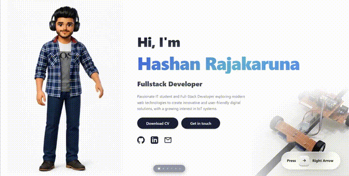

  

  <strong>Hashan Rajakaruna</strong> · Software Engineer · University of Moratuwa

  Full-Stack Development &nbsp;·&nbsp; IoT & Embedded Systems &nbsp;·&nbsp; Cybersecurity

  <a href="https://hashanrajakaruna.site">Portfolio</a> &nbsp;·&nbsp;
  <a href="https://linkedin.com/in/hashan-rajakaruna">LinkedIn</a> &nbsp;·&nbsp;
  <a href="mailto:hashanrajakaruna733@gmail.com">Email</a>

---

  

  

<!-- react icon covers React.js + React Native -->

  

<!-- django icon covers Django + Django REST Framework -->

  

<!-- mysql icon covers MySQL + MSSQL -->

  

<!-- auth0, i18next, ballerina have no skillicons equivalent -->